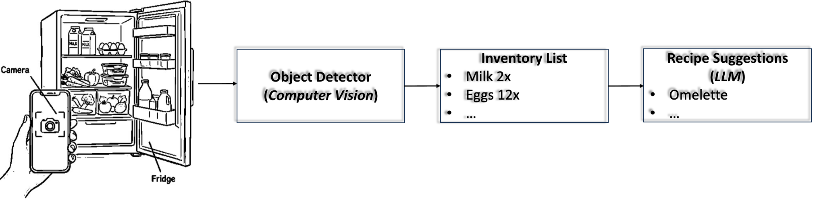
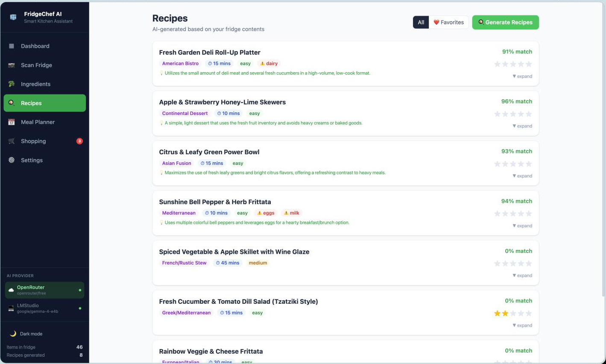
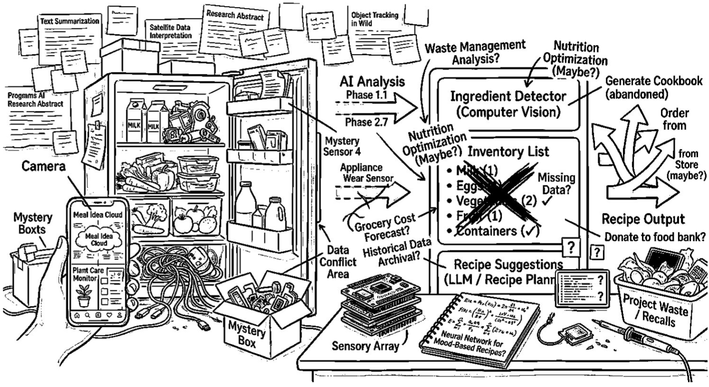

## Overview

This slide deck presents two sample AI100 project ideas, with a comparison of them available at the end.

# Project A: Fridge Inventory → Meal Planner (Strong)

## Project A: Project Pitch

### 👁️‍🗨 Overview

- **Domain:** Food / health / home organization
- **App:** A tool that lets users send a photo of their fridge so the AI app can identify ingredients and suggest recipes, shopping lists, and reminders about what may expire soon 📸➡️🍳

## Project A: Project Pitch (continued)

### 🎯 Task

Users upload a fridge photo:

- The AI system identifies visible ingredients and expiry dates.
- The system recommends recipes and meal plans based on the contents of the fridge, with optional shopping-list items and reminders about what may expire soon.

## Project A: Project Pitch (continued)

### 📱 Inputs/Outputs

- **Input:** Refrigerator photos with visible food items and expiry dates.
- **Output:** A structured inventory plus ranked recipe suggestions.
- **Optional outputs:** Shopping-list items for missing ingredients and expiry reminders.

## Project A: Project Pitch (continued)

### 🤖 AI approach

- **Computer vision** to read ingredients and dates.
- **Large language model** to generate and rank recipe suggestions.

## Project A: Project Pitch (continued)

### 🔧 Implementation

A possible prototype pipeline is:

1. Upload fridge image.
2. Run object detection / visual recognition.
3. Write the detected inventory into a structured list.
4. Suggest and rank recipes based on the inventory, nutritional information, and expiry dates.
5. Optionally generate a shopping list for missing items.

## Project A: Prototype Image

{fig-align="center" width="75%"}

## Project A: Ethical Topics ⚖

### Reliability and autonomy risks

Failure cases?

- The system might misidentify ingredients or expiry dates, leading to poor or unsafe suggestions.
- It may suggest allergen-containing recipes.
- It may suggest culturally narrow recommendations (i.e., biased toward western diets).

## Project A: Ethical Topics ⚖ (continued)

### Reliability and autonomy risks

Who decides values?

- Popular (but unhealthy) recipes vs. healthy recipes
- The project raises questions about who decides what counts as "healthy," which nutrition standards are used (e.g., European vs. American nutrition guidelines), and how much users should rely on the system.

## Project A: Ethical Topics ⚖ (continued)

### Direct effects on individuals

Users:

- Could benefit from healthier choices, less food waste, and easier meal planning (depending on how good is the app).
- Users could also be harmed if they over-trust the system or receive inaccurate or inappropriate recommendations.

## Project A: Ethical Topics ⚖ (continued)

### Direct effects on individuals

Content creators:

- Cookbook authors, bloggers, youtubers, etc., could lose traffic or sales if AI-generated recipe support substitutes for their content.

## Project A: Ethical Topics ⚖ (continued)

### Malicious use

Privacy violations:

- Fridge photos may reveal socioeconomic status (i.e., signs of food insecurity, income level), household size, dietary restrictions, and cultural background.

## Project A: Ethical Topics ⚖ (continued)

### Malicious use

Hacking and security concerns:

- Attackers might manipulate the app to produce unsafe outputs or misleading recommendations. For example, they might recommend foods that are toxic together or when consumed. They might also recommend foods that have passed their expiration date.

## Project A: Ethical Topics ⚖ (continued)

### Economic impacts

Jobs:

- Meal-planning apps, meal-kit companies (like HelloFresh), and food-content businesses could be affected by the widespread use of this kind of tools.

### Effects on corporations

Advertising and privacy concerns:

- Companies could use the system for targeted advertising based on what is missing from a user's fridge.

## Project A: Ethical Topics ⚖ (continued)

### Effects on corporations

Copyright:

- The app also raises copyright questions about whether generated recipes are original or memorized/closely-derived from existing sources such as cookbooks.

## Project A: Ethical Topics ⚖ (continued)

### Effects on governments

Regulations:

- Regulators may need to consider whether AI systems that make food-safety or allergen-relevant suggestions require stronger oversight similar to FDA approval for medical devices.

## Project A: Ethical Topics ⚖ (continued)

### Effects on governments

Climate:

- Governments may also be interested in these systems as tools for reducing food waste, etc, for a sustainable future.

## Project A: Ethical Topics ⚖ (continued)

### Possible AI futures

Road forward:

- Similar AI systems could evolve into smart-kitchen ecosystems with automated ordering, recommendation, and household management managed entirely by AI and robots. That raises broader questions about convenience, dependence, and the future of food culture.

## Project A: Ethical Topics ⚖ (continued)

### Possible AI futures

Super human:

- Can AI systems like this one eventually become better than human nutritionists and chefs at planning meals that are delicious (novel flavor combinations, for instance), healthy, and sustainable?

## Project A: Agent-coded Web App

{fig-align="center" width="80%"}

Note: This prototype web app is not required for your project pitch. *Later on in the term* you need to build a prototype after your project is approved.

# Project B: AI for Food, Health, and Sustainability (Weak)

## Project B: Project Pitch

### 👁️‍🗨️ Overview

- **Domain:** Food, health, shopping, sustainability, and smart home integration.
- **App:** An AI kitchen assistant that understands everything in the fridge, predicts future food needs, optimizes nutrition, automatically orders groceries, plans weekly meals, tracks health, and helps reduce waste.
- **TL;DR:** A system to help people make better food choices 🍽️🛒📈🌍🤖​

## Project B: Project Pitch (continued)

### 🎯 Task

- The proposed system tries to handle food planning, nutrition, shopping, health, sustainability, prediction, and home device integration.

### 📱 Inputs/Outputs

- Uses Fridge photos, grocery purchase history, user habits and preferences, health information, and home device information to generate suggestions, meal plans, useful grocery actions, health-related feedback, and possibly automated decisions.

## Project B: Project Pitch (continued)

### 🤖 AI approach

- State-of-the-art Multimodal AI (e.g., ChatGPT) + smart reasoning + personalized machine learning.

### 🔧 Implementation

- The system would scan the fridge/kitchen, track groceries over time, understand nutrition, predict future meals, recommend recipes, order missing ingredients, manage a meal plan, monitor health, and help reduce food waste.
- Potentially connect to wearables, delivery apps, and smart kitchen appliances.

## Project B: Prototype Image

{fig-align="center" width="65%"}

## Project B: Ethical Topics ⚖

### Reliability and autonomy risks

- The system might not always work correctly and could produce poor food or health recommendations.

### Direct effects on individuals

- Users may rely on it too much and stop making their own decisions.

### Malicious Use

- The use of health-related data makes privacy concerns more serious.

## Project B: Ethical Topics ⚖ (continued)

### Economic impacts

- The system could change how people shop for food and use food-related services and affect food-chain related industries.

### Effects on corporations

- No clear effect identified.

## Project B: Ethical Topics ⚖ (continued)

### Effects on governments

- Reduce food waste, save resources, improve public health.

### Possible AI futures

- AI may play a bigger role in everyday life and personal decision-making in the future.​

# Project A vs. Project B

## 

| Dimension | Project A (Strong) | Project B (Weak) |
|------------------------|------------------------|------------------------|
| 🎯 Task | [Well-scoped]{style="color:#7dbb5f; font-weight:600;"} task: meal planning based on fridge inventory | [Broad-scoped]{style="color:red; font-weight:600;"} task: tries to solve food/health, shopping/budgeting, and sustainability at once​ |
| 📱 Inputs / Outputs | [Clear]{style="color:#7dbb5f; font-weight:600;"} and explicit | [Vague]{style="color:red; font-weight:600;"} and loosely defined |
| 🤖 AI approach | [Named]{style="color:#7dbb5f; font-weight:600;"} AI methods with distinct roles | [Buzzword]{style="color:red; font-weight:600;"} AI: no clear method is explained​ |

## 

| Dimension | Project A (Strong) | Project B (Weak) |
|------------------------|------------------------|------------------------|
| 🔧 Implementation | [Concrete]{style="color:#7dbb5f; font-weight:600;"} pipeline: fridge photo → detect ingredients → suggest recipes | [Complex]{style="color:red; font-weight:600;"} pipeline: sounds more like a startup product vision than a class project |
| ⚖️ Ethics | [Specific]{style="color:#7dbb5f; font-weight:600;"} and interesting ethical trade-offs | [Generic]{style="color:red; font-weight:600;"} and interchangeable with many AI apps |
| 🧪 Prototypability | [Easy]{style="color:#7dbb5f; font-weight:600;"} to imagine as a simple AI-oriented web app | [Hard]{style="color:red; font-weight:600;"} to identify what the first prototype would be |

## 

| Dimension | Project A (Strong) | Project B (Weak) |
|------------------------|------------------------|------------------------|
| 🔭 Scope | [Focused]{style="color:#7dbb5f; font-weight:600;"}, with optional extensions | Keeps [expanding]{style="color:red; font-weight:600;"} instead of narrowing |
| 👁️‍🗨️ Overall | [Strong]{style="color:#7dbb5f; font-weight:600;"} project: doable ✅ | [Weak]{style="color:red; font-weight:600;"} project: ambitous 🚫 |

**Remember:**

- In project development, we should aim for ideas that are specific, prototypable, understandable, and ethically interesting.
- A strong idea becomes more concrete as you explain it; a weak one stays blurry.​
