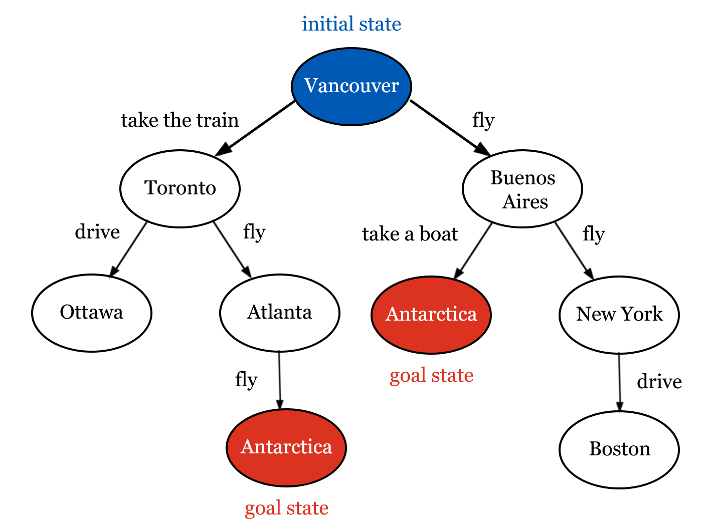

## Lecture overview
### Learning outcomes
- TODO

### Pre-class work
::: {.content-hidden when-profile="student" when-profile="ta"}
#### Instructors
1. TODO

#### Coordinators
1. TODO
:::

::: {.content-hidden when-profile="student"}
#### TAs
1. TODO
:::

#### Learners
1. TODO

### Lecture timeline
::: {.list-table}
- - Topic
  - Time
  - Materials

- - Admin
  - 5 min

- - [Differences from previous lectures](#sec-prev-lectures)
  - 10 min

- - [Search inputs and outputs](#sec-inputs-outputs)
    - Tic-tac-toe
  - 10 min

- - [Trees](#sec-trees)
    - Tic-tac-toe as a tree
  - 10 min

- - [Search algorithms](#sec-algos)
    - Depth- and breadth-first search
    - Minimax 
  - 30 min

- - [Wrap-up](#sec-wrap-up)
  - 10 min

- - Admin
  - 5 min
:::

### Post-class work
::: {.content-hidden when-profile="student" when-profile="ta"}
#### Instructors
1. TODO

#### Coordinators
1. TODO
:::

::: {.content-hidden when-profile="student"}
#### TAs
1. TODO
:::

#### Learners
1. TODO

## Differences from previous lectures{#sec-prev-lectures}
- We can explicitly write a set of instructions to perform a task or reach a goal.
- However, we might not always know what those instructions should be, or what instructions are best. We want to start moving away from the idea of programming everything manually.
- **Search** gives us a structured way to come up with these instructions.

:::{.callout-tip}
### Activity: Discussion
Imagine planning a trip from Vancouver to Antarctica without using a travel guide or map software. What information would you need to plan the route? What might make one route better than another?
:::

## Search inputs and outputs{#sec-inputs-outputs}
- We have a few important **inputs**:
    - Each situation we could be in is called a **state.** We know what situation we are in now: this is the **initial state**. We also know what kind of situation we want to end up in: this is the **goal state**.
    - In each state, we know what actions we could take to reach other states: these are **state transitions**.
- We ultimately want to know the series of actions we need to take to reach our goal: this is our **output**.
- In the trip planning example:
    - We know we are starting in Vancouver and that we will be happy if we reach Antarctica.
    - We know that from Vancouver we could fly (to Dublin, Seoul, Denver, Buenos Aires...), drive (to Chilliwack, Calgary, Squamish), take the train (to Seattle, Portland, Toronto), and so on. We also know about the other cities and towns around the world, and the transportation options between them.
    - We would like to know the list of steps we should take to reach Antarctica.

### Tic-tac-toe

:::{.callout-tip}
### Activity: Discussion
What would the inputs be if we wanted to represent tic-tac-toe with search? What would the output be?
:::
- States are a particular layout of the board and an indicator of whose turn it is. The initial state is an empty board with X as the current player, and the goal state is any board with three Xs or Os in a row. [TODO: full board/tie??]
- In each state, the current player can place one of their symbols in a free space. This action causes the game to transition from the current state to a different state: in this new state, it will be the other player's turn, and there will be another symbol on the board.

## Trees{#sec-trees}

- We can represent states and transitions visually using a **tree** diagram. States are shown as circles, and transitions are arrows linking different states.
- For example, we could build a smaller version of the Vancouver-to-Antarctica problem as a tree.
  - In the tree below, the only possible states are Vancouver, Buenos Aires, Antarctica, New York, Toronto, Ottawa, Atlanta, and Boston, and the only possible transitions are the ones shown alongside the arrows (e.g. fly from Vancouver to Buenos Aires, drive from Toronto to Ottawa, etc).
  - The tree allows us to see clearly that, to go from the initial state (Vancouver) to the goal state (Antarctica), we could take the train to Toronto, fly to Atlanta, and then fly to Antarctica. Alternatively, we could fly to Buenos Aires and then take a boat to Antarctica.
  - The real problem would be a lot bigger! Imagine how many states and transitions you would need to represent the entire breadth of places you could go from Vancouver, and how big the tree would be. 



### Tic-tac-toe as a tree

:::{.callout-tip}
### Activity: Tic-tac-tree
Play a few games of tic-tac-toe with the widget below and follow along with the tree. TODO: what reflection questions should go here
:::

```{=html}
<iframe src="../html/lecture-03_tic-tac-toe.html" width="100%" height="350px" style="border:none;"></iframe>
```

## Search algorithms{#sec-algos}
- We can use trees to search for goal states in a more structured way!
- There are lots of ways we can search through trees, including **depth-first search (DFS)** and **breadth-first search (DFS)**.

### Depth- and breadth-first search
- In DFS, we follow transitions from a state as far as possible before moving left-to-right along a layer of states. TODO: phrase this better lol

```{=html}
<iframe src="../html/lecture-03_dfs.html" width="100%" height="650px" style="border:none;"></iframe>
```

- In BFS, we fully explore each layer of states left-to-right before moving on to the next layer.

```{=html}
<iframe src="../html/lecture-03_bfs.html" width="100%" height="650px" style="border:none;"></iframe>
```

:::{.callout-tip}
### Activity: Think, pair, share
In the widgets above, DFS and BFS end up finding different goal states.

- What kinds of problems do you think DFS is better suited for? What kinds of problems do you think BFS is better suited for?
- Which goal state is better? Which approach is better overall for this problem?
:::

- In this example, you probably want to take the fewest number of steps to reach Antarctica.
- DFS is not the best solution in this case - if some goal states are further away from the initial state than others, DFS might find the further states first. On the other hand, since BFS visits all of the states in order, it is guaranteed to find whichever goal state is closest to the initial state. 
- However, consider a different example where all goal states should be around the same level, much further down in the tree. BFS would waste a lot of time checking all of the states higher up, while DFS would find a goal state much faster. 
- DFS and BFS don't consider whether any of the transitions are better than others - if you get seasick, you might prefer to fly to Antarctica via Atlanta, but this preference is not represented in either approach.
- It would also be difficult to use DFS or BFS for a problem like tic-tac-toe, since your next move depends on the other player's actions.
- Lots of other search strategies exist! We will focus on **minimax search**, as it addresses this two-player problem.

### Minimax search
- Instead of just checking whether we've reached a goal state, we give every goal state a **utility**: a number describing how good that outcome is for one of the players. For example, we could give a utility of 1 to any state where X has won, -1 to any state where O has won, and 0 to a draw.
  - This means that X wants to end up in a state with the highest utility possible, and O wants to end up in a state with the lowest utility possible.
- We already know the utility of every goal state. For any other state, we can only work out its utility once we know the utility of every state it could transition to.
  - If it's X's turn, the state's utility is the highest utility among the states it could transition to, i.e. we assume that X does the thing that ultimately works out best for them.
  - If it's O's turn, the state's utility is the lowest utility among the states it could transition to, i.e. we assume that O does the thing that ultimately works out best for them.
- We repeat this, working upward from the goal states toward the initial state, until every state in the tree has a utility. 
- Once the initial state has a utility, we know which move to make! We follow whichever transition leads to the state that gave the initial state its utility, and so on, until we reach a goal state.

:::{.callout-tip}
### Activity: TODO
TODO minimax activity would be good, but what? Ideas:

- tic-tac-toe like the widget above with hints (two-player)
- tic-tac-toe vs the computer who has minimax (single-player)
- figuring out the minimax decision for a small subtree - better done as a visualization like above??
:::

## Wrap-up{#sec-wrap-up}

:::{.callout-tip}
### Activity: Discussion
- TODO: when is search not ideal? -> large search space, have to figure out all actions and states...
- TODO: more questions
:::
