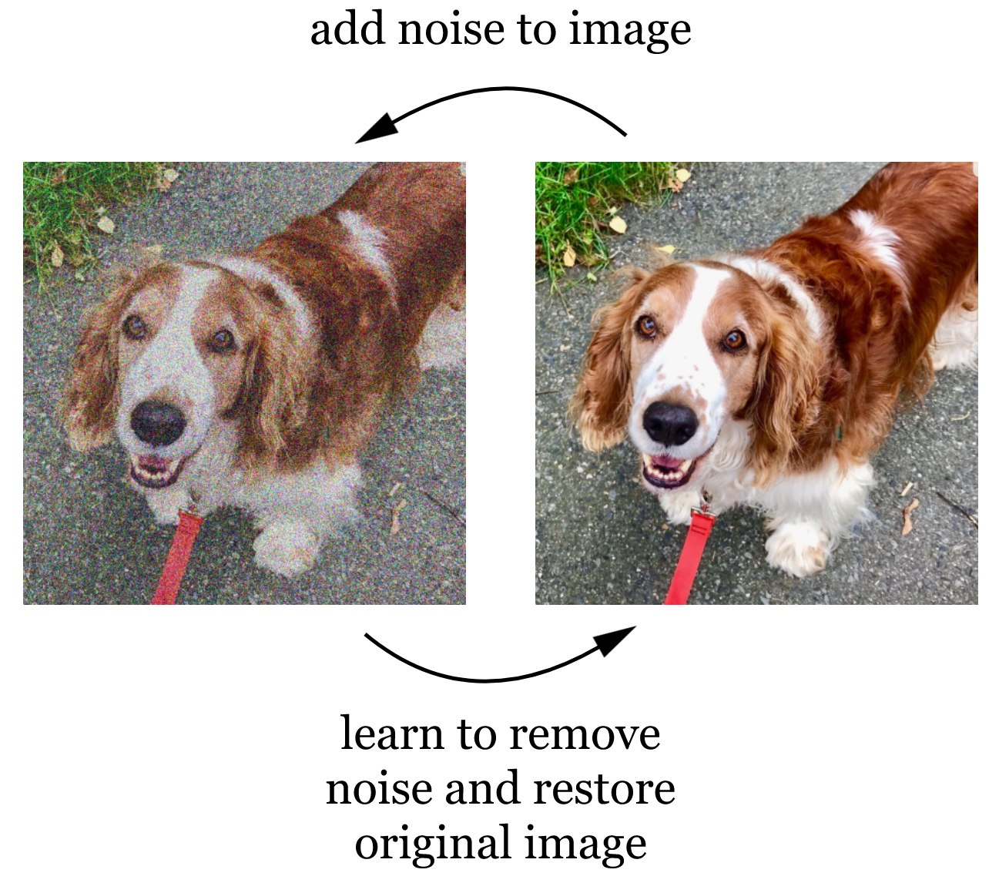
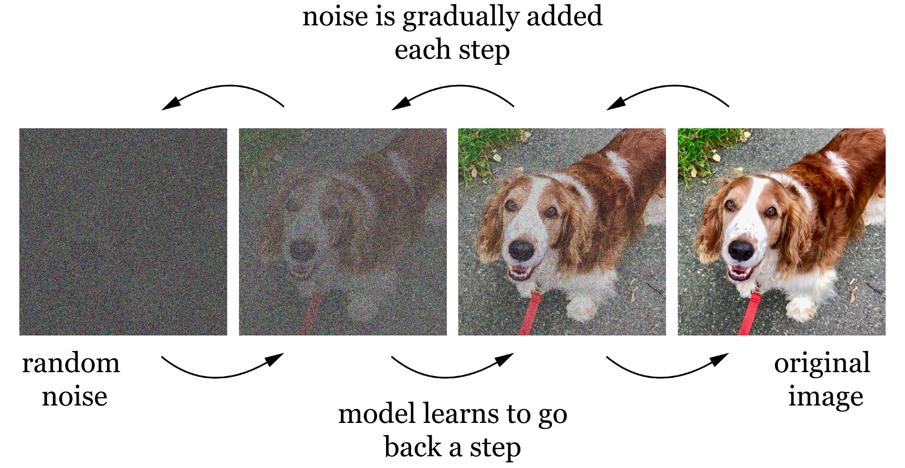
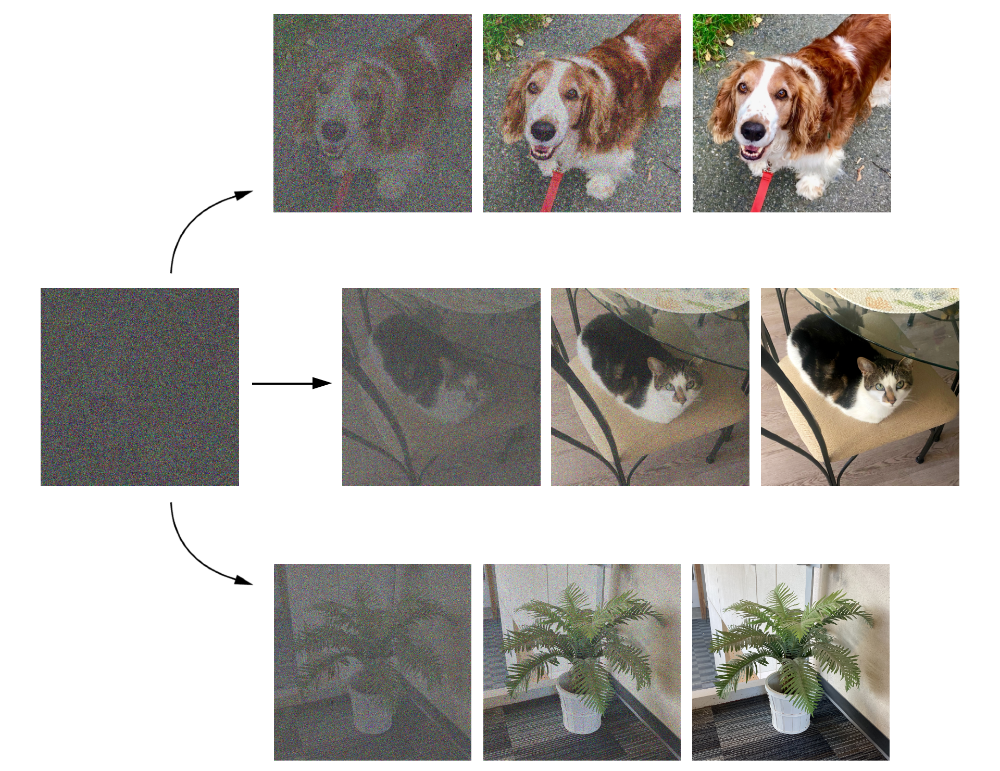

## Lecture overview
### Learning outcomes
- TODO

### Pre-class work
::: {.content-hidden when-profile="student" when-profile="ta"}
#### Instructors
1. TODO

#### Coordinators
1. TODO
:::

::: {.content-hidden when-profile="student"}
#### TAs
1. TODO
:::

#### Learners
1. TODO

### Lecture timeline
::: {.list-table}
- - Topic
  - Time
  - Materials

- - Admin
  - 5 min

- - [Differences from previous lectures](#sec-prev-lectures)
  - 5 min

- - [Next token prediction](#sec-next-token)
  - 30 min

- - [Diffusion models](#sec-diffusion)
  - 10 min

- - [Images and text](#sec-image-text)
  - 25 min

- - [Wrap-up](#sec-wrap-up)
  - 10 min

- - Admin
  - 5 min
:::

### Post-class work
::: {.content-hidden when-profile="student" when-profile="ta"}
#### Instructors
1. TODO

#### Coordinators
1. TODO
:::

::: {.content-hidden when-profile="student"}
#### TAs
1. TODO
:::

#### Learners
1. TODO

## Differences from previous lectures{#sec-prev-lectures}
- Up until now, we've been **supervising** AI systems to some extent - i.e., giving models feedback from an explicit, human-generated source as they learn.
  - In machine learning and deep learning, we supervise the model by labelling our training examples and comparing our labels to the model's output.
- We also have a desire to use bigger datasets to improve performance and reduce bias. However, labelling large datasets manually can be both difficult and costly. 
  - In deep learning, we reduce the human workload somewhat by having the model interact with the raw data instead of explicit features. Could this be possible with labels?
- With a **self-supervision** approach, models get feedback from the unlabelled data itself.

## Next-token prediction{#sec-next-token}

:::{.callout-tip}
### Activity: Continue the sentence
Form groups of 4-5. A piece of paper with an incomplete sentence on it will be passed around your group. When the paper comes around to you, add whichever word you think should continue the sentence and pass it to your neighbour.
:::

- Why did you choose to write the words you did? You probably looked at the rest of the sentence - especially the previous word - and used your experience with the English language to pick the word that made the most sense.
- This is one example of self-supervision!
  - As **input**, we give the model the beginning of a sample sentence, often taken from a book or a website. The model then predicts and **outputs** the next word. 
  - Since we already know the rest of the sentence, we can check whether the model got it right, and the model adjusts its **parameters** to better represent the relationship between the start of the sentence and the next word. Eventually, the model should have a good sense of which word should come next.
  - Notice that we didn't have to do any extra work - the sentence already existed when we approached the problem!
- Instead of working with full words, models can use **tokens** instead. Tokens are word chunks of various sizes, e.g. the word "friendly" could be broken into two tokens: "friend" and "ly".

:::{.callout-tip}
### Activity: Hands-on next-word prediction
Let's get a more intuitive sense of how the words that came before can help predict the word that comes next. Consider these sample sentences:

> the dog is eating  
> the dog loves the food  
> the dog loves eating food  
> is the dog eating  
> the dog loves the dog food  
> the food is dog food  

Count how many times each word is immediately followed by each other word, and fill in the table below. The first row is already complete - "dog" follows "the" 6 times in the sentences above, and "food" follows "the" twice. Use the final <end> column to count how often each word ends a sentence.

```{=html}
<iframe data-external="1" src="../html/lecture-07_table.html" width="100%" height="400px" style="border:none;"></iframe>
```

The numbers in the table above represent how common it is for one word to follow another. For example, "the dog" shows up more often than "the food". 

Let's try generating a new sentence! Starting from "the", imagine we always pick the most common next word:

> the dog loves the dog loves the dog loves the...

What's the problem here? Always picking the most likely word means we end up getting the same few words over and over. Let's add some randomness instead: we'll pick the next word at random, but weigh the odds so that more common words are more likely to come up. Use the wheel below to generate some random sentences. 

```{=html}
<iframe data-external="1" src="../html/lecture-07_wheel.html" width="100%" height="450px" style="border:none;"></iframe>
```
Now reflect on the sentences you generated:

- Did randomization improve the output?
- What could you change to make the wheel more likely to create coherent and varied sentences?
- Can you generate any sentences that are exactly the same as the sample sentences? How do you feel about this?
:::

- Notice that, instead of just labelling data, we created brand new sentences word-by-word. AI that creates new content like this is called **Generative AI**.

## Diffusion models{#sec-diffusion}
- **Diffusion models** also rely on self-supervision.
  - During training, they use images as both **input** and **output**. A small amount of **noise** is added to an input image, and the model learns how to remove that noise to restore the original image.



  - This process is then repeated at increasing levels of noise: more noise is added to the already-noisy image, and the model learns to reverse that step too. The model's **parameters** define how to remove a small amount of noise at any given noise level.



  - Eventually, the model is able to gradually turn random noise into a coherent image, step by step. If we train the model on lots of different images, it learns to **output** a completely new picture from random noise.




## Images and text{#sec-image-text}
- As described above, diffusion models cannot be asked to generate any particular image via text input - they just remove noise step by step.
- However, the diffusion approach can be combined with a bit of **supervision** to get an image-to-text model, like Stable Diffusion or DALL-E.
  - Like diffusion models, images are used as both **input** and **output** during training. Each input image is also paired with a caption, like "a dog on a leash". 
  - The model is trained to do two tasks at the same time. It learns to remove noise from image step-by-step, but also learns to associate images and their captions. [TODO: what are the parameters]
  - Once the model is trained, it can use an **input** prompt to guide the way the noise is removed, leading to an **output** image that matches the text prompt.

:::{.callout-tip}
### Activity: Text to image
Form groups of 4-5. Choose someone in the group to draw a random shape on a piece of paper.

Now, consider the prompt "Draw a potted plant". Pass the paper around within your group. Each person may make one small change to the drawing when the paper comes around to them, e.g. adding a simple shape or erasing a small part of the drawing. Every change you make should make your drawing more similar to the prompt.

The instructor will compare a few different drawings. How do the drawings differ? How are they similar?
:::

- TODO more content needed?

## Wrap-up{#sec-wrap-up}

:::{.callout-tip}
### Activity: Discussion
- TODO
- what other uses of self-supervision can you imagine existing? eg masking
:::