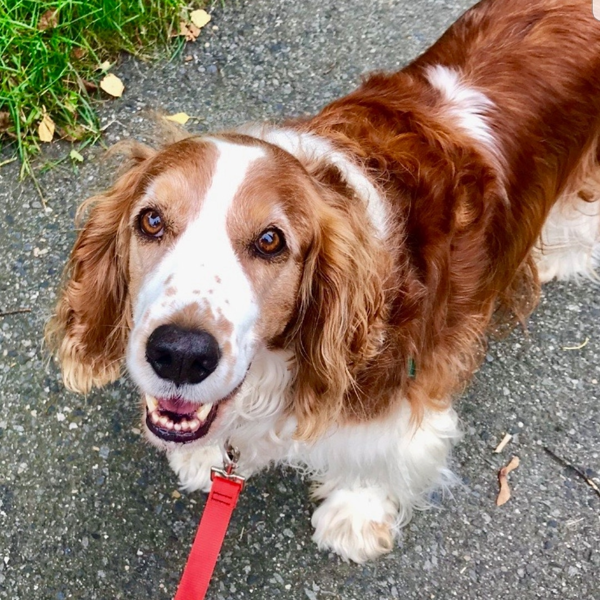
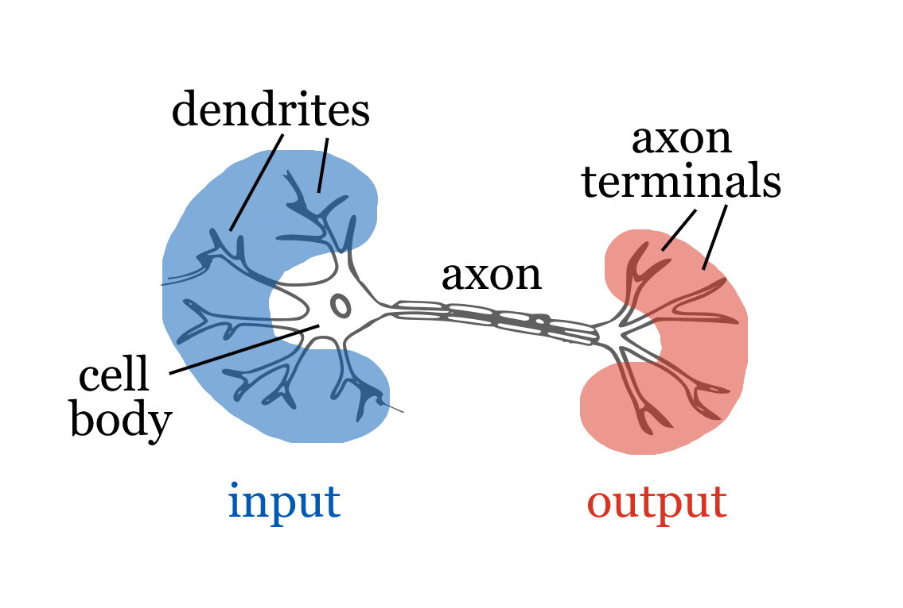
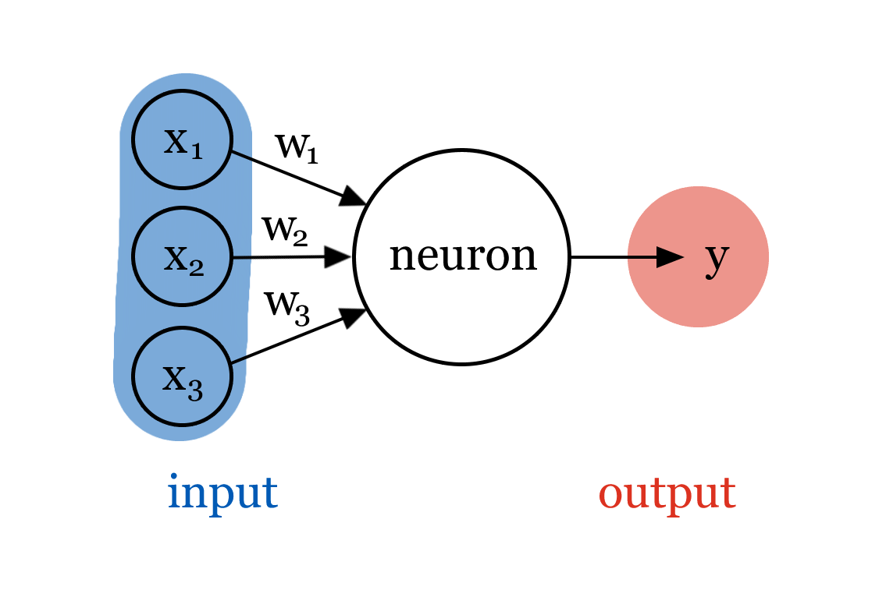
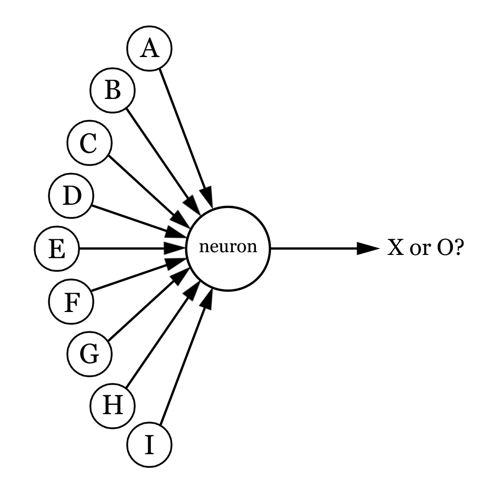
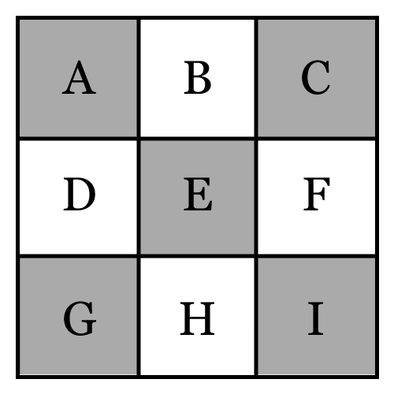
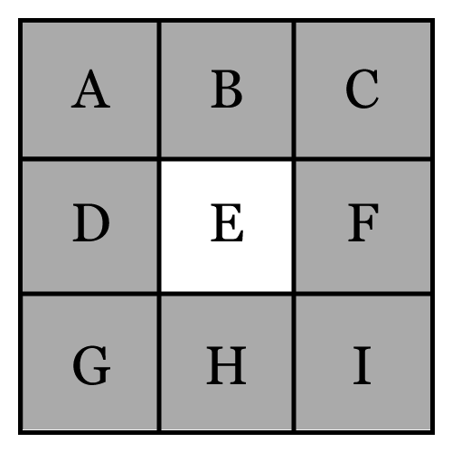
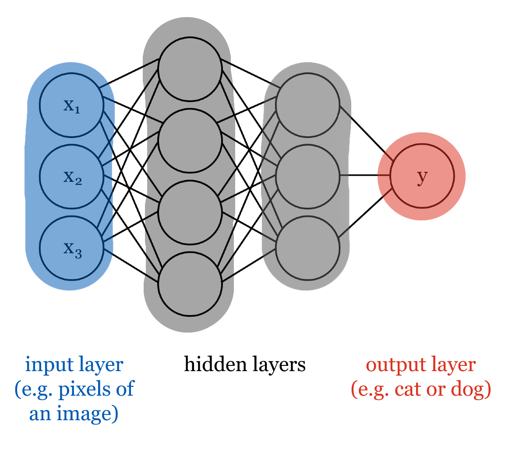

## Lecture overview
### Learning outcomes
By the end of this lecture, you will be able to:

- Recognize that deep learning can learn directly from raw data (such as image pixels), without features chosen by people. <!-- Remember -->
- Recognize that an artificial neuron takes in several inputs and produces one output. <!-- Remember -->
- Explain that the weights are the parameters a network learns during training and that they set how much each input influences the output. <!-- Understand -->
- Describe how neurons are arranged into input, hidden, and output layers to form a deep neural network. <!-- Understand -->
- Distinguish what is chosen before training (the number of layers and neurons) from what is learned during training (the weights). <!-- Analyze -->
- Recognize that a network improves by comparing its predictions to the correct answers and adjusting its weights (a process called backpropagation). <!-- Remember -->
- Explain how the distribution of the training data affects a model's overall accuracy and its accuracy for individual groups. <!-- Understand -->
- Explain, using a real example such as facial-analysis systems, how unrepresentative training data can make a model biased and unfair. <!-- Understand -->
- Explain why a deep neural network's predictions are hard to interpret (the transparency problem), and compare its interpretability with that of a decision tree. <!-- Analyze -->

### Pre-class work
::: {.content-hidden when-profile="student" when-profile="ta"}
#### Instructors
1. TODO

#### Coordinators
1. TODO
:::

::: {.content-hidden when-profile="student"}
#### TAs
1. TODO
:::

#### Learners
1. TODO

### Lecture timeline
::: {.list-table}
- - Topic
  - Time
  - Materials

- - Admin
  - 5 min

- - [Differences from previous lectures](#sec-prev-lectures)
  - 5 min

- - [Activity: Google Teachable Machine](#sec-teachable-machine)
  - 10 min
  - [Website: Google Teachable Machine](https://teachablemachine.withgoogle.com/train/image)

- - [Neurons, weights, and networks](#sec-neuron-weight)
  - 10 min

- - [Backpropagation](#sec-backprop)
  - 15 min

- - [Bias and fairness](#sec-bias)
  - 15 min

- - [Neural network challenges](#sec-challenges)
  - 5 min
  
- - [Wrap-up](#sec-wrap-up)
  - 10 min

- - Admin
  - 5 min
:::

### Post-class work
::: {.content-hidden when-profile="student" when-profile="ta"}
#### Instructors
1. TODO

#### Coordinators
1. TODO
:::

::: {.content-hidden when-profile="student"}
#### TAs
1. TODO
:::

#### Learners
1. TODO

## Differences from previous lectures{#sec-prev-lectures}
- In machine learning, we start by choosing which features we want to use to train our model.
- However, identifying and engineering features can be very time consuming, and may require expert knowledge.

:::{.callout-tip}
### Activity: Guess who?
In pairs, you will each be given a picture of a cat or a dog. Don't show the picture to your partner! Instead, describe what you see in the picture, and see if they can guess correctly. What properties of the picture helped your partner the most?
:::

- It is relatively easy for humans to identify properties that differentiate dogs and cats - for example, you might have used ear shape to guess which animal your partner had. However, the machine learning problems we've seen so far require these properties to be formally identified and given to the model as features. Imagine looking at thousands of images of dogs and cats and manually filling in which ear shape each one has... very boring!
- Instead of trying to come up with features ourselves, it might be better to just give the images to the model and let it figure out these useful properties as part of the training process.
- Computers can't "see" like we can, so we represent an image using the colour of each of its pixels.

## Activity: Google Teachable Machine{#sec-teachable-machine}
- TODO what are we trying to get across here? is this just another example of deep learning?
- TODO formalize instructions
- [TODO: any issues with using the webcam/images of prof or students? alternatively have a set of images ready to upload]
- have prof or volunteer student come up to front and use webcam to record images of them doing 2 distinct things (smiling/frowning, left/right of screen, wearing hat/not wearing hat, etc). train model, then test whether it can differentiate the 2 distinct things
- with ~100 images per class and 2 classes, takes ~2 min to train. do not switch tabs during training as it will stop
- after demonstration at front, could let students try on their own:
  - add more classes
  - train with object added to/removed from background between two different unrelated classes (e.g. smiling with water bottle, frowning without) and see how adding/removing the object during testing changes the accuracy
  - train with one person smiling/frowning and use another person smiling/frowning to test
    - see if model improves if both people are used to train
  - do something that wasn't in either class and see which class it is more like (e.g. shocked face). why do you think that is/what properties probably make that the case? (e.g. if shocked is most like smiling, eyebrow movements might be similar, etc...)

## Neurons, weights, and networks{#sec-neuron-weight}
::: {#fig-cat-dog layout-ncol=2}




Images of a cat (Ripley) and a dog (Midnight).
:::
- In the figure above, you are probably able to identify which picture is a cat and which picture is a dog pretty quickly. Humans are able to do these kinds of classification tasks very efficiently.
- To simulate the same level of performance with a machine, we took inspiration from biological neural networks (our brains!) when designing a new type of model: **artificial neural networks**.

### Neurons
::: {#fig-neurons layout-ncol=2}




Biological and artificial neurons. Base image of biological neuron from OpenClipart-Vectors on Pixabay.
:::

- Neural networks are made up of neurons. Just like the neurons that make up our brains, each neuron takes some number of **inputs** and produces an **output**. Inputs can be raw data, e.g. pixels from the original image, or outputs from other neurons. 
- In the image above, the artificial neuron has three inputs ($x_1, x_2, x_3$), and its output is $y$.

### Weights
- Inside each neuron, inputs are **combined** to produce an output.

:::{.callout-tip}
### Activity: Think, pair, share
Consider a neuron that takes nine inputs: the colour of each pixel in a small 3x3 image. We want the output of the neuron to represent whether a particular image shows an X or an O. 

::: {#fig-x-o layout-ncol=3}






The pixels of small 3x3 images are given as input to a neuron (left). Each image may be an X (middle) or an O (right). Each input is labelled A through I.
:::

Are all of the inputs equally important to consider? If not, which ones might be more important, and why?
:::

- Not every input is equally as important to a neuron - it might be more valuable to **weigh** inputs differently. 
- When combining inputs, we multiply each input by its respective weight. Important inputs are assigned larger weights: this way they make a larger impact on the output than the other inputs. Similarly, less important inputs are assigned smaller weights.
- In the image above, input $x_1$'s weight is $w_1$, $x_2$'s weight is $w_2$, and $x_3$'s weight is $w_3$.
- Weights are a neural network's **parameters**: during the training process, the network learns how important each input is and thus what weight it should have.

### Neural networks
::: {#fig-network}


A neural network.
:::

- We can stack **layers** of neurons to make a **neural network**.
  - Since we input each example (e.g. the pixels of a training image) into the network in the first layer, we call it the **input layer**.
  - The last layer is called the **output layer**. Each neuron in this layer outputs something we want to know, like a prediction of whether an image is a cat or a dog.
  - We can add layers of neurons between the input and output layers: these are called **hidden layers**. The more hidden layers we add, the better the neural network gets at modelling complex relationships between examples and their associated labels.
  - We call a neural network with lots of layers a **deep** neural network - this is why we call the overall approach **deep learning**.
  - Note that the structure of the neural network is **not** learned - before the training process starts, we decide how many layers and neurons we want.

## Backpropagation{#sec-backprop}
- How do we train a neural network? In other words, for each neuron in the network, how do we figure out which weights its inputs should have?
- We use an approach called **backpropagation**:
  - To start, we set each weight to a random number. Then, we use the network to predict the label for each example in the training data. Since all of the weights were randomized, they don't necessarily reflect how important each neuron's inputs are - these initial predictions probably won't be very good!
  - We compare each prediction to the actual label to know how accurate the predictions were. Then, we use this feedback to make small changes to the weights - we think these changes might make the model a little more accurate, but we don't really know.
  - We repeat this process - predict labels for the training data, compare to the real labels, and adjust the weights - until we feel satisfied that the model is accurate enough, or until changing the weights doesn't make the model any more accurate.

```{python}
#| echo: false
#| warning: false
%run ../python/lecture-05_nn.py

run()
```

## Bias and fairness{#sec-bias}

:::{.callout-tip}
### Activity: Distribution of training data
Imagine an emotion recognition tool. We have a dataset of 240 faces, labelled as either sad or happy, and we want to predict whether new faces are sad or happy. This is a great application for deep learning!

Some of the faces in our dataset have dark skin, and others have light skin. The sliders in the visualization below allows you to adjust how many faces from each group are in the dataset of 240 faces. In the visualization below, the plot on the left shows the number of happy and sad faces across the two groups. The plot on the right shows the overall accuracy (number of correct predictions in the entire dataset), as well as the per-group accuracy (number of correct predictions for people with a particular skin colour).

Use the sliders to change the distribution of skin colour and emotion in the dataset, and discuss the following with your neighbours:

- What effect does the skin colour slider have on the accuracy scores? What effect do the label sliders have?
- Do you trust any of the accuracy scores more or less than the others?
- What arrangement of sliders would you say produces the best model? Why is it the best?
- This activity is based on [Dr. Joy Buolamwini's research](https://www.media.mit.edu/projects/gender-shades/overview/) on facial recognition. As a Black woman, her experience with leading tech companies' facial recognition software differed significantly from her colleagues: not only did the tools struggle to identify her face, but they often incorrectly classified her as a man. 
  - Considering Dr. Buolamwini's experience, what do you think the distribution of skin colour in the dataset might have looked like? What about the gender distribution?
  - Why do you think the dataset ended up like this? Could any real-life biases be involved?
:::

```{=html}
<iframe src="../html/lecture-05_bias-visualizer.html" width="100%" height="800px" style="border:none;"></iframe>
```
- As we've seen, differences in the distribution of the training set can lead to very different models.
- If our labels aren't balanced, our model won't have the chance to learn enough from each label to make meaningful predictions, and will perform poorly overall. 
  - For example, if most of the training set is made up of happy faces, the model won't be able to see enough sad faces to learn what the differences are. 
- Even if our labels are perfectly balanced, imbalances in the groups included in the dataset can lead to **biased** models that perform differently for different groups. In AI, we call this difference an issue of **fairness**.
  - For example, if most of the faces in the training set have light skin, the model should perform well on people with light skin. However, it won't be able to see enough happy and sad people with dark skin to learn what the differences are for them.
- In this example, bias was easy to spot, but this isn't always the case. We are all biased, and that bias influences the data we collect in ways we might not initially notice.

## Neural network challenges{#sec-challenges}

### Scale
- Since images can have lots of pixels, and we use each individual pixel as an input to a neural network, we can end up with a very large input layer. Similarly, if each connection between neurons needs a weight, we end up with a lot of parameters!
- Training models this large is very challenging for a few reasons:
  - As seen above, bias is a concern. We need our model to be able to look at a lot of data with lots of variety to make sure it behaves well, both in general and across groups.
  - Training a neural network involves a huge number of calculations. We'd like these calculations to happen as quickly as possible, so that we can finish training our model in a reasonable amount of time. 
- Depending on your computer's hardware, it can perform a certain number of calculations per second. Computers with good GPUs are particularly fast at doing the kinds of calculations we need for model training. 
- We call this resource **compute**, and the bigger our models get, the more compute they need for the training process.

### Transparency
- Another problem arises when we try to understand why certain predictions are being made.
  - We can get some sense of what is going on in the input layer. Pixels from the original image are used as input to the first hidden layer, and each pixel has an associated weight. From the weights, we can tell that different neurons find certain pixels more important than others, and we know how the neurons combine the pixels into outputs. However, we can't assign any natural-language meaning to what any given neuron does.
  - As we move deeper into the network, it becomes even more difficult to understand what each neuron is actually doing. By the time we reach the output layer, it is impossible to explain exactly why we predicted the label we did.
- Imagine your job application being rejected because the company used a neural network to predict how good of an employee you will be. You would likely have questions for the hiring manager about what aspects of your profile caused you to be rejected - and since they used a neural network, they can't really answer those questions in a satisfying way. 
- In AI, we call this an issue of **transparency**.

## Wrap-up{#sec-wrap-up}

:::{.callout-tip}
### Activity: Discussion
- TODO
- Does a decision tree have the same transparency problems as a neural network? Why or why not?
:::