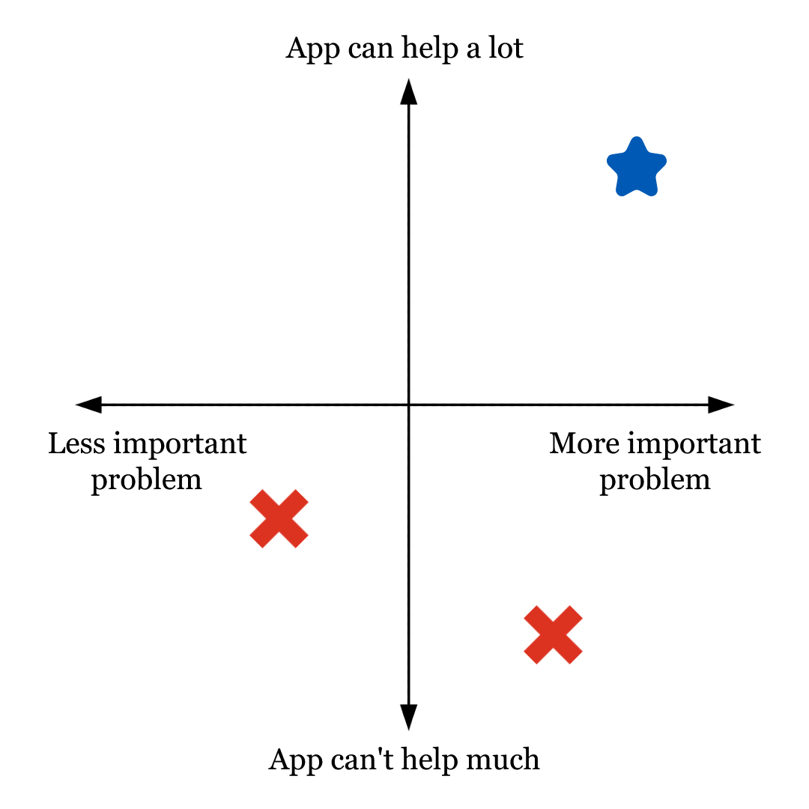

## Overview

- In today's activity, you will learn elements of the **design process** that will help you identify real-world problems and think about how to best address them in your project.
- You will also learn to **use AI to simulate** steps of the design process when access to other resources is limited.

## Task 1: Your Interests

- The best topic for a project is one you care about.​
- Start by writing down 2-3 areas or topics that matter to you or that you care about. Some examples:​
    - Hiking​
    - Playing chess​
    - Doing well in school​
    - Staying in touch with friends​
    - …really anything goes!​

## Task 2: Identify a Problem

- For each of your areas of interest, identify a problem that you are affected by and would like to solve.
- If it helps, you can try completing this sentence: "When I __________ [hike/play chess/study...], I sometimes have trouble with __________ ."
    - For example: "When I plan a camping trip, I sometimes have trouble with finding a campsite on provincial websites."

## Task 3: Could an App Help?

- Can you imagine an app helping you with the problem you described?​ Identify 2-3 tasks that you would like the app to do, which you think would provide a solution to your problem. 
    - It is ok if the app provides some help but does not solve the entire problem!​
    - If you believe an app cannot help with one of the problems you identified, move onto the next problem!​
- If it helps, you can add to the sentence you made before. 
    - For example: "When I plan a camping trip, I sometimes have trouble with finding a campsite on provincial websites, and I would like an app to collect and synthesize information about campsites near me and their availability."​

## Task 4: Breaking Ties

- If you have multiple good contenders, consider the following points that might help you break the tie:
    - **Problem importance**: Is this a problem that genuinely affects me or people like me?​
    - **Frequency**: How often does this problem occur?​
    - **Impact**: If solved, how much would it improve someone's life or experience?​
    - **Feasibility**: Could I realistically develop this app concept within the next two months?
    - **Personal motivation**: Am I excited enough about this idea to focus my energy on it for the rest of the term?​
    - **AI usage**: Does it make sense to apply AI to this problem?
- Finalize your choice of problem!

## Task 4: Breaking Ties (cont'd)

##  Personas and Pain Points

- At this point, you should have identified a problem you would like to solve and have a basic intuition of how a potential app could help – great!​ 
    - You may want to jump right into implementation, but that would be unwise, as you just started thinking about this.​
- **Design thinking** teaches us to solve problems not by guessing, but by talking to the people affected. Those **users** are the best way to understand real **pain points** that they experience, before we try to provide fixes for them.​
    - So, the first step is to think about who your users are and what their pain points are.​

## Task 5: Identifying Users

- Brainstorm and write down a list of different types of users that would use your app to solve or address the problem at hand. We call these types of users **personas**.
- For example, there are lots of different types of campers: experienced campers, novice campers, elderly campers, families with small kids, campers who have accessibility needs (like a wheelchair), etc. Each of those are a persona.

​[TODO do we want Parsa's graphic here?]

## Task 6: Can AI Help?

- Generative AI may help you think of users that you would not have thought about on your own.​
- Write a prompt to ask an AI chatbot to generate a bigger list of users for your app, including interesting details about them.
    - Prompts should be specific and give enough context for the model to understand what you want.
    - What kinds of things should be included in this prompt?
- Prompt the AI and compare its response to your original list.
    - Does it include users or details you did not think about?​
    - Does it fail to include users you think are important?

## Task 7: User Interview Questions

- At this point in design thinking, you would reach out to potential users of your app to interview them, learn about their experiences and preferences, and overall try to **empathize** with their perspective. ​
- Pick two of your personas that you want to learn more about and come up with some interview questions for each one.
    - Ask about the personas themselves, their personal experiences with the problem, what they already do (if anything) to help them with the problem...​

## Task 8: Simulating User Interviews

- Real users are the best source, but can be hard to come by - this is where GenAI can help through simulated interviews.​
- Ask AI to conduct two persona interviews, acting as each of your personas. The goal here is to figure out who they are, how they are engaging with the problem, and what their specific pain points are.

## Task 9: Evaluating AI

- Before we summarize our findings from these interviews, let's assess their quality. Discuss the following with your neighbours: 
    - Did you feel that the users answered questions in a way that matched their character?​
    - Did you notice odd similarities between answers?​
    - Do you think it matters that the Gen AI experiences are not real? Does your answer change if we consider using this approach in the long term instead of just this once?

## Task 10: Findings and Insights

- Using the interviews and your own notes, create a summary of the top 3-5 tasks that your app needs to complete.
    - Draw a star next to the tasks that you hadn’t considered initially. Did any core functionalities of your app change once you learned more about the personas? How? ​
- Summarize your findings to someone you haven't talked to yet! ​Don't forget to include:
    - What problem are you trying to solve?​
    - Which personas are particularly important?​
    - How did the interviews change the direction of your app?
